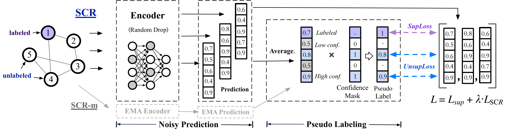

# SCR: Training Graph Neural Networks with Consistency Regularization

This repository is the official implementation of SCR.

## Overview
We conduct experiments on the node classification task, which is one of the most popular benchmark tasks for graph learning. We use three datasets from Open Graph Bench-mark (OGB), including ogbn-products, ogbn-mag, and ogbn-papers100M. Overall, we have achieved **top-1** performance on three OGB datasets. 

  
  
  
  
  
  
  
  
## Training
Please look the details in Readme.md of each dataset inside the corresponding folder.

## Node Classification Results:

Performance on **ogbn-products**(10 runs):
| Methods   | Validation accuracy  | Test accuracy  |
|  ----  | ----  |  ---- |
| GAMLP+SCR  | 0.9330±0.0006 | 0.8407±0.0006  |
| SAGN+SCR-m  | 0.9325±0.0004 | 0.8441±0.0005  |
| GAMLP+SCR-m  | 0.9319±0.0003 | 0.8462±0.0003  |
| GAMLP+RLU+SCR  | 0.9292±0.0005 |  0.8505±0.0009  |
| GAMLP+RLU+SCR+C&S  | 0.9304±0.0005 |  **0.8520±0.0008**  |
| GIANT-XRT+GAMLP+SCR-m  | 0.9402±0.0004 | 0.8591±0.0008 |
| GIANT-XRT+SAGN+SCR  | 0.9364±0.0005 |  0.8667±0.0009  |
| GIANT-XRT+SAGN+SCR+C&S  | 0.9357±0.0004 | **0.8680±0.0007** |
| GIANT-XRT+SAGN+SCR-m  | 0.9389±0.0002 |  0.8651±0.0009  |
| GIANT-XRT+SAGN+SCR-m+C&S  | 0.9387±0.0002 | **0.8673±0.0008** |

Performance on **ogbn-papers100M**(3 runs):
| Methods   | Validation accuracy  | Test accuracy  |
|  ----  | ----  |  ---- |
| GAMLP+SCR  | 0.7190±0.0007 | 0.6814±0.0008  |
| GAMLP+SCR-m  | 0.7186±0.0008 | 0.6816±0.0012  |
| GAMLP+RLU+SCR  | 0.7188±0.0007 |  **0.6842±0.0015**  |

Performance on **ogbn-mag**(10 runs):
| Methods   | Validation accuracy  | Test accuracy  |
|  ----  | ----  |  ---- |
| NARS_GAMLP+SCR  | 0.5654±0.0021 | 0.5432±0.0018  |
| NARS_GAMLP+SCR-m  | 0.5590±0.0028 | 0.5451±0.0019  |
| NARS_GAMLP+RLU+SCR  | 0.5734±0.0035 |  **0.5631±0.0021**  |


## Citation
Our paper:
```
@misc{zhang2021improving,
      title={Improving the Training of Graph Neural Networks with Consistency Regularization}, 
      author={Chenhui Zhang and Yufei He and Yukuo Cen and Zhenyu Hou and Jie Tang},
      year={2021},
      eprint={2112.04319},
      archivePrefix={arXiv},
      primaryClass={cs.SI}
}
```

CogDL paper:
```
@article{cen2021cogdl,
    title={CogDL: Toolkit for Deep Learning on Graphs},
    author={Yukuo Cen and Zhenyu Hou and Yan Wang and Qibin Chen and Yizhen Luo and Xingcheng Yao and Aohan Zeng and Shiguang Guo and Peng Zhang and Guohao Dai and Yu Wang and Chang Zhou and Hongxia Yang and Jie Tang},
    journal={arXiv preprint arXiv:2103.00959},
    year={2021}
}
```

GIANT paper:
```
@article{chien2021node,
  title={Node Feature Extraction by Self-Supervised Multi-scale Neighborhood Prediction},
  author={Eli Chien and Wei-Cheng Chang and Cho-Jui Hsieh and Hsiang-Fu Yu and Jiong Zhang and Olgica Milenkovic and Inderjit S Dhillon},
  journal={arXiv preprint arXiv:2111.00064},
  year={2021}
}
```
GAMLP paper:
```
@article{zhang2021graph,
  title={Graph attention multi-layer perceptron},
  author={Zhang, Wentao and Yin, Ziqi and Sheng, Zeang and Ouyang, Wen and Li, Xiaosen and Tao, Yangyu and Yang, Zhi and Cui, Bin},
  journal={arXiv preprint arXiv:2108.10097},
  year={2021}
}
```
SAGN paper:

```
@article{sun2021scalable,
  title={Scalable and Adaptive Graph Neural Networks with Self-Label-Enhanced training},
  author={Sun, Chuxiong and Wu, Guoshi},
  journal={arXiv preprint arXiv:2104.09376},
  year={2021}
}
```

C&S paper:
```
@inproceedings{
huang2021combining,
title={Combining Label Propagation and Simple Models out-performs Graph Neural Networks},
author={Qian Huang and Horace He and Abhay Singh and Ser-Nam Lim and Austin Benson},
booktitle={International Conference on Learning Representations},
year={2021},
url={https://openreview.net/forum?id=8E1-f3VhX1o}
}
```
